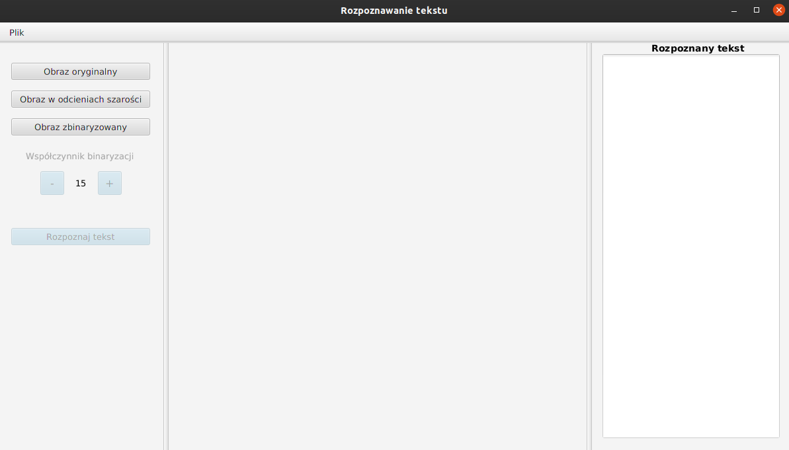
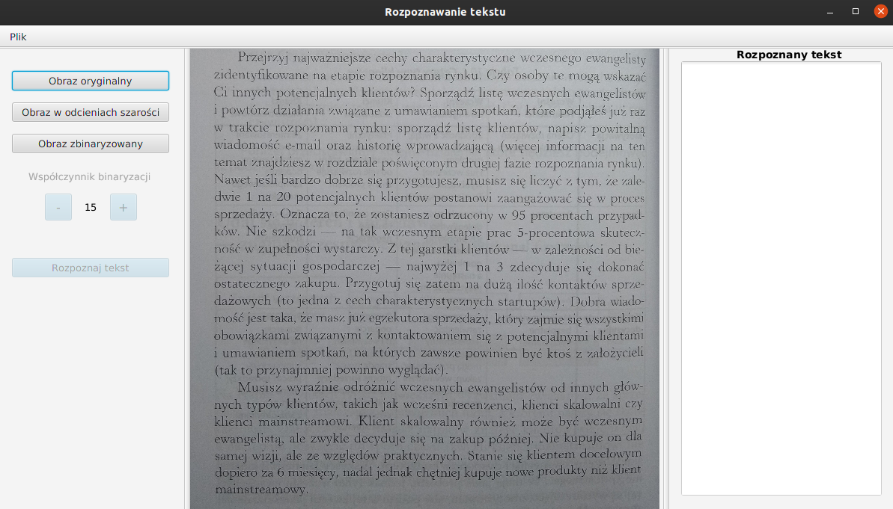
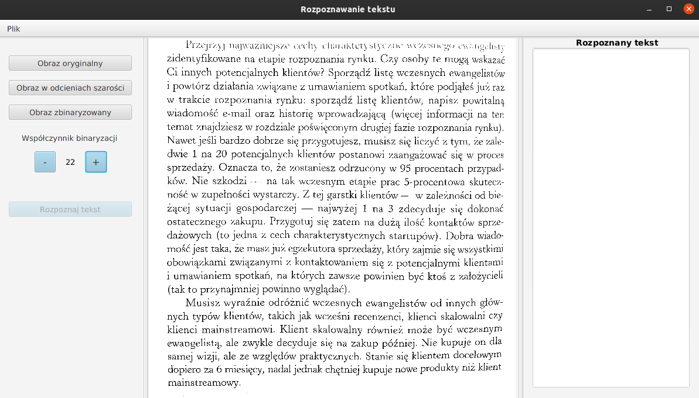

# Text Recognition Project

## Opis projektu
Celem projektu było stworzenie programu, który po wczytaniu obrazka 
zawierającego tekst wypisał go na ekran.

## Interfejs





Aby wczytać obraz należy wybrać 
- Plik -> Wczytaj obraz

Na ekranie głównym ukaże nam się podgląd obrazka. Dostępne będą teraz dla nas operacje 
konwersji obrazka do odcieni szarości, operacja binaryzacji oraz wyświetlenie obrazka oryginalnego.
Ich użycie spowoduje wywołanie odpowienich metod oraz odpowiednią zmianę podglądu obrazka. Poniżej przycisku znajdują 
się kontrolki służące do zmiany współczynnika binaryzacji.

Aby rozpoznać tekst należy wczytać obraz, który zawiera znaki tekstowe. Następnie po 
wykonaniu binaryzacji na danym obrazie (konwersja do odcieni szarości wykona się w tle) 
odblokuje się przycisk `Rozpoznaj tekst`. Rozpoznany tekst powinien ukazać się na prawym panelu.

## Co jest potrzebne do kompilacji oraz uruchomienia projektu?
- `git` (do sklonowania repozytorium - ewentualnie można ściągnąć w formacie zip i wypakować)
- `JDK 11`

Aby skompilować i uruchomić projekt wystarczy kolejno wykonać komendy:
```bash
git clone https://github.com/hubert-mazur/text-recon.git
cd text-recon/src/META-INF
jar cmvf MANIFEST.MF text-recon.jar ../main ../binarize/ ../Row/ ../Letter/ # budujemy archiwum jar
java --module-path=../../JavaFX/javafx-sdk-11.0.2/lib/ --add-modules=javafx.controls,javafx.fxml,javafx.web,javafx.base,javafx.graphics -jar text-recon.jar
```

## Co projekt robi?
Projekt potrafi:
- wczytać oraz wyświetlić obrazek





- konwertować obrazek do odcieni szarości


- konwertować binaryzować obrazek


- wprowadzać korekty we współczynniku binaryzacji





- oddzielać litery oraz zapisywać je do plików `.png`


## Co nie działa?
Popełniliśmy znaczący błąd gdy uznaliśmy, że Java jest dobrym językiem do tworzenia sieci neuronowych.
Podjeliśmy wszystkie kroki w kierunku nauki sieci neuronowej, lecz sama jej implementacja znacząco nas przerosła.
Projekt:
- nie rozpoznaje liter i nie wypisuje ich na prawy panel.
- nie radzi sobie z krzywym, zniekształconym tekstem (wiersze tekstu muszą być poziome).

## Wykonane elementy
- Kacper Kapuściak:
	- interfejs oraz jego funkcjonalność
	- dokumentacja
- Hubert Mazur:
    - konwersja do odcieni szarości oraz binaryzacja
    - oddzielanie i zapis liter do pliku 

Informacje o użytym przez nas algorytmie ze szczegółowym opisiem można znaleźć [w dokumencie](AdaptiveThresholding.pdf)